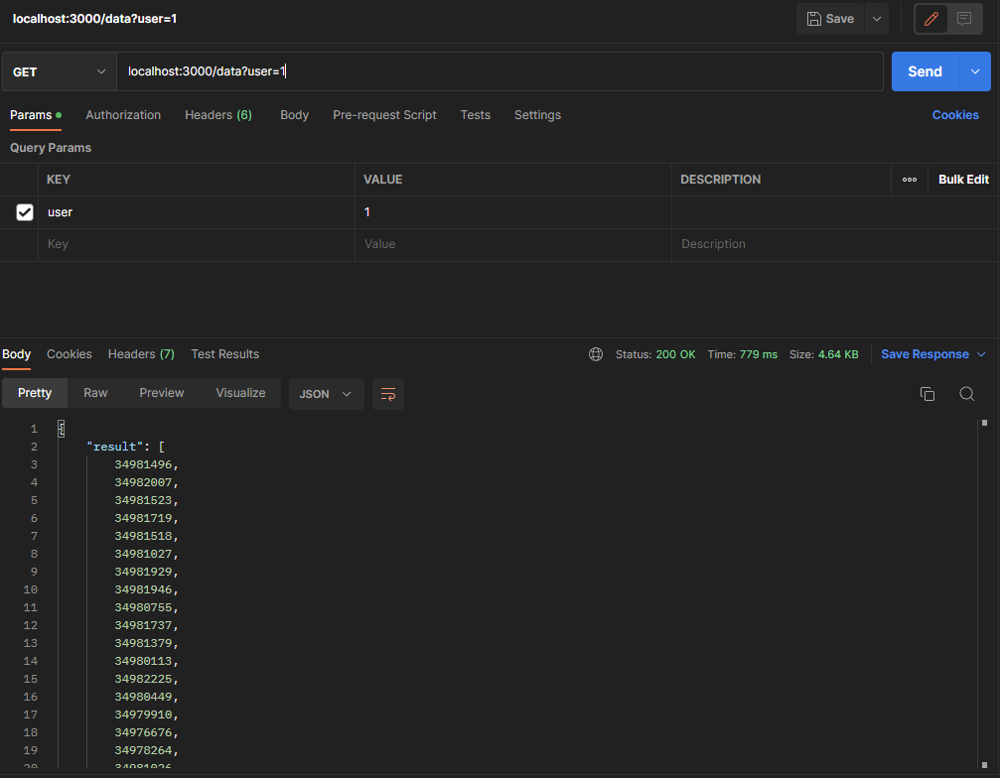
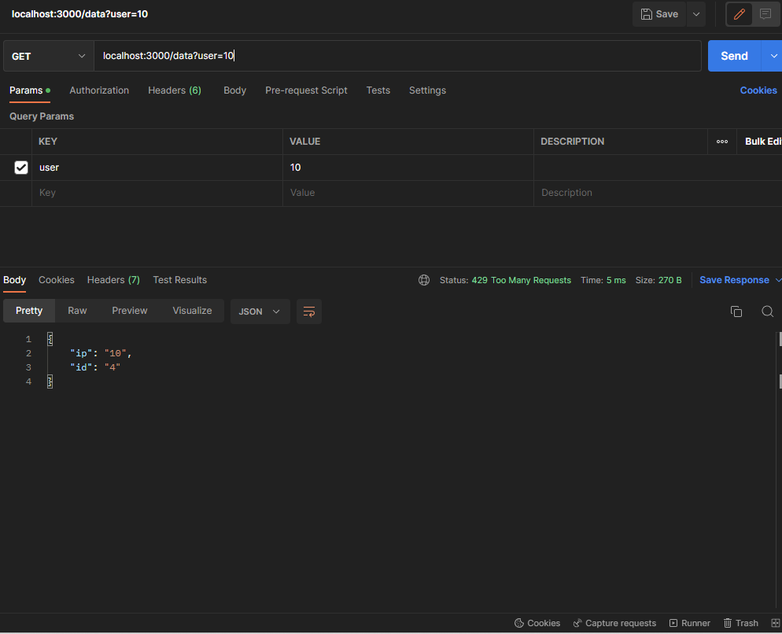
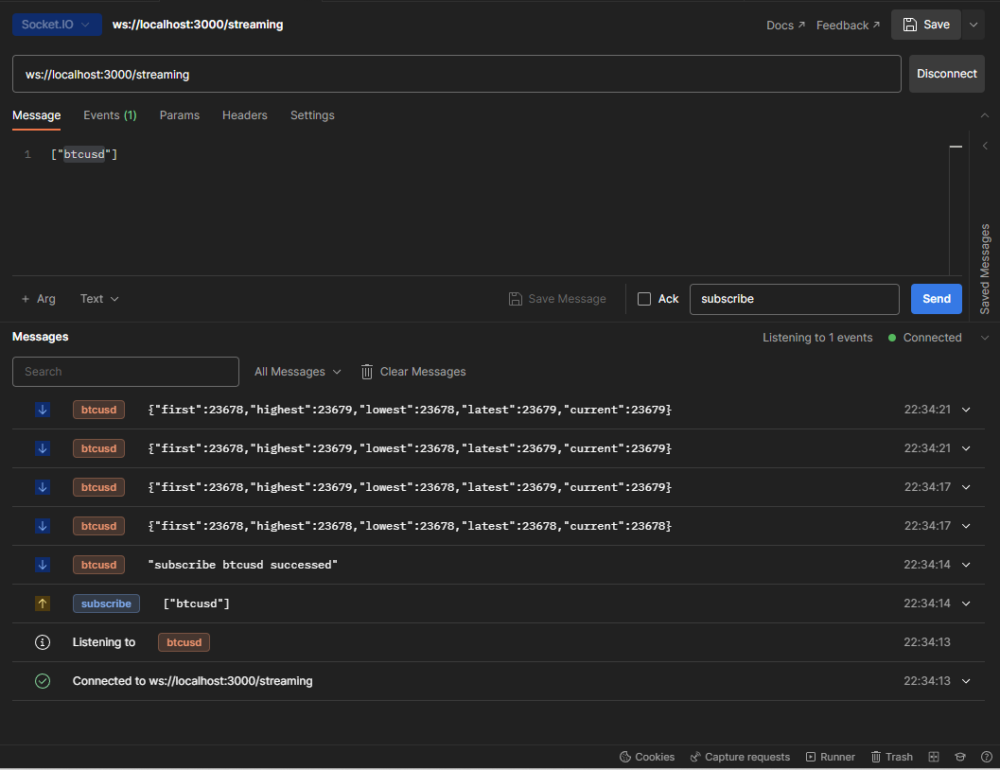

# Introduction

-   Fugle backend engineer pretest
-   Implement a proxy to another server, including restful API and socket
-   Part 1: HTTP API
    -   GET http://localhost:3000/data?user=id
    -   proxy for https://hacker-news.firebaseio.com/v0/topstories.json?print=pretty
    -   if success, return { result: data }
    -   if fail, return status code 500
-   Part 2: Rate Limiting
    -   implement middleware for part 1 API
    -   in every minute, every user can access at most 5 times and every ip for 10 times
    -   if excesse limitation, return status code 429 and response body { ip: ipCount, id: userCount }
-   Part 3: WebSocket API
    -   ws://localhost:3000/streaming
    -   proxy for [Bitstamp WebSocket API](https://www.bitstamp.net/websocket/v2/)
    -   subscribe/unsubscribe specific currency pair
    -   broadcast OHLC for subscribers

# System Requirement

## Production

-   [Docker](https://docs.docker.com/get-docker/)

## Development

-   [Docker](https://docs.docker.com/get-docker/)
-   [vscode](https://code.visualstudio.com/download)
-   [vscode docker extention](https://marketplace.visualstudio.com/items?itemName=ms-azuretools.vscode-docker)
-   Other dependencies will be installed with devcontainer automatically
-   `Important!!` if you use windows, you should `git config --global core.autocrlf false` before you clone this project, otherwise windows will convert LF to CRLF, which lead all shell scripts fail.

# Build & Run

## Production

-   Interpreted mode

    ```
    cd /path/to/project/root/
    docker-compose -p fugle -f .prodcontainer/interpreted.yml up --force-recreate
    ```

-   Binary mode

    -   Compile project to binary code.
    -   In binary mode, it can run more faster, use less disk space and be more anti-reversing.
    -   This mode is not stable on windows. If it build fail on windows, please run it in WSL CLI
    -   Please switch to interpreted mode.

    ```
    cd /path/to/project/root/
    docker-compose -p fugle -f ./.prodcontainer/binary.yml build --parallel --no-cache
    docker-compose -p fugle -f .prodcontainer/binary.yml up --force-recreate
    ```

## Development

-   We use vscode devcontailer for development environment
-   Open vscode in project root directory
-   Press `ctrl + shift + p` enter `Dev Containers: reopen in container` to build devcontainer.
-   It will build docker for development environment and install dependent package for this project automatically.
-   Run the project with the commands blew

    -   yarn run dev: run server in development mode
    -   yarn run prod: run server in production mode
    -   yarn run test: run all testing files
    -   yarn run translate:
        -   Transpile ES6 module in this project to commonjs.
        -   The result will be in `build` folder.
        -   `Please don't use this command in devcontainer!!`
    -   yarn run build:
        -   Compile this project to binary executed file.
        -   The result will be in `build` folder.
        -   `Please don't use this command in devcontainer!!`

# Development Environment

-   [vscode devcontainer](https://code.visualstudio.com/docs/devcontainers/containers)
-   docker-compose for nodejs and redis

# Development Guidelines

-   Use `git cz` in CLI to use formated commit message.
-   pre-commit will run all testing cases automatically before all commits. (see [husky](https://www.npmjs.com/package/husky) for details)
-   Developers can run testing with jest extention on the vscode extention bar
-   If jest extention didn't show in extention bar, please reload vscode window manually.
-   If you use windows, you should `git config --global core.autocrlf false` before you clone this project, otherwise windows will convert LF to CRLF, which lead all shell scripts fail.

# System Structure

```
📂<project_folder>
┣📂.devcontainer // config for development environment
┃ ┣📜setup.sh // developemnt environemnt initialization
┃ ┣📜docker-compose.yml // docker-compose file for development environemnt, including nodejs and redis
┃ ┗📜devcontainer.json
┣📂.prodcontainer // config for production environment
┃ ┣📜.dockerignore // denotes files that won't be used in production mode
┃ ┣📜binary // Dockerfile for deploying system in binary mode
┃ ┣📜binary.yml // docker-compose file for binary mode
┃ ┣📜interpretive // Dockerfile for deploying system in interpretive mode
┃ ┗📜interpretive.yml // docker-compose file for interpreted mode
┣📂.husky // shell scripts for git hooks
┃ ┗📜pre-commit // pre-commit script, which will run all testing before commit
┣📂build // temporal directory for compiling code to binary file
┣📂node_modules // directory for nodejs packages
┣📂src // source code
┃ ┣📂main // system implementation
┃ ┃ ┣📂controller // define API endpoints & do data validation
┃ ┃ ┃ ┗📜data.js // controller for hacker news APIs
┃ ┃ ┣ 📂services // scripts that get data from other services
┃ ┃ ┃ ┣📜hackerNews.js // hacker news data fetcher and validator
┃ ┃ ┃ ┗📜redis.js // all redis operation
┃ ┃ ┣ 📂middleware // scripts run before controllers
┃ ┃ ┃ ┗📜rateLimitor.js.js // rate limitor based on user id and ip
┃ ┃ ┣ 📂socket // scripts that get data from other services
┃ ┃ ┃ ┣📜bitstamp.js // socket client to bitstamp server
┃ ┃ ┃ ┗📜client.js // proxy socket server for subscribe/unsubscribe to upstream server
┃ ┃ ┣📜app.js // code for building the server
┃ ┃ ┗📜server.js // code for running the server
┃ ┗📂test
┃   ┣📂mockData
┃   ┃    ┣📜mockData  // mock testing data
┃   ┃    ┗📜mockServerAndApi  // dummy server and API for testing
┃   ┗📂testCases  // all test scripts
┃   ┃    ┣📜hackerNews.test.js
┃   ┃    ┣📜rateLimiter.test.js
┃   ┃    ┗📜socket.test.js
┣📂thunder // config for thunder client (tools similar to postman)
┣📜.babelrc // config for babel (tool for compiling js code to older versions)
┣📜.pretittierrc // config for pretittier (auto-formatter tool)
┣📜babel.config.json // config for babel (tool for compiling js code to older versions)
┣📜package-lock.json // detailed information for packages installed in the current environment
┣📜package.json // config for nodejs packages
┗📜readme.md // basic description of this project
```

# Testing

-   `Thunder Client` (a tool similar to postman but can be intergrated with vscode) for testing manually
-   `Jest` for testing programmatically
-   Set fixed return to external API with `nock`
-   Build dummy socket servers for testing OHLC socket
-   Set NODE_ENV as "testing" while running jest to switch env
-   Test cases
    -   Hacker news
        -   Hacker news return expected data
        -   Hacker news return unexpected data
        -   Hacker news internal error
    -   Rate limiter
        -   Same user access the API 6 times in same minutes
        -   Same ip access the API 11 times in same minutes
    -   OHLC socket
        -   subscribe
        -   unsubscribe
        -   disconnection (unsunscribe all)
        -   single currency pair data
        -   multile currency pair data

# Postman Example




